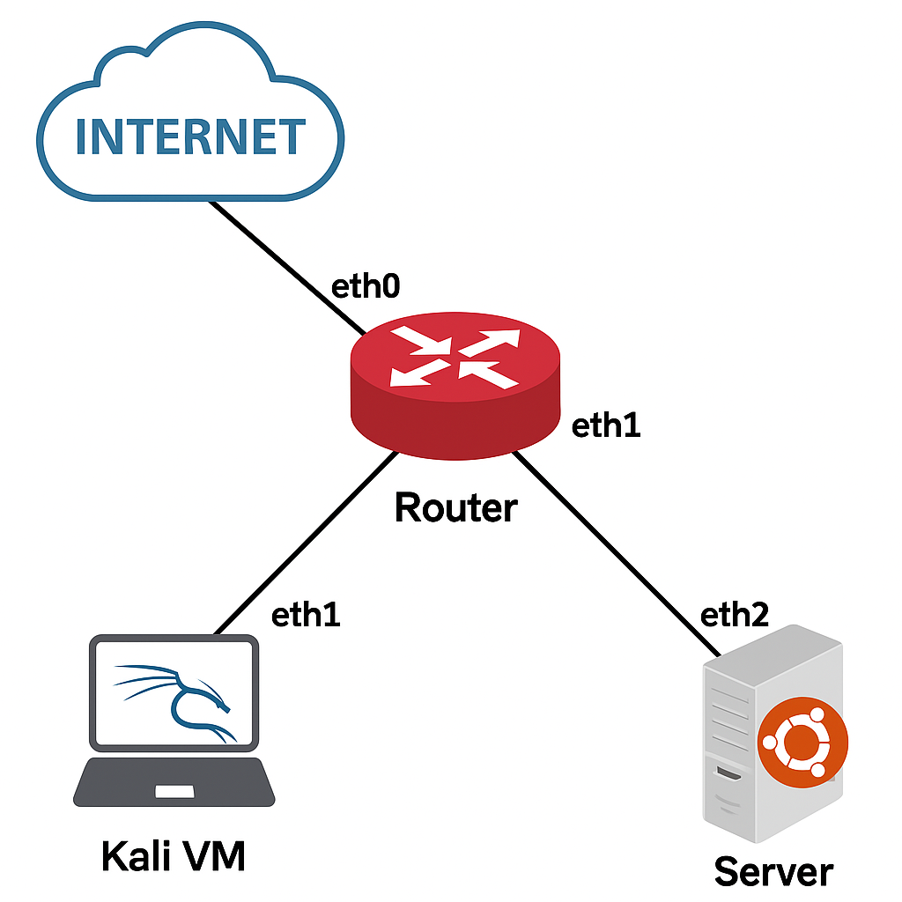

# SOC-Intrusion Detection Simulation

This project simulates a cyberattack inside a virutal network build using GNS3. The goal is to demonstrate how a SOC analyst detects and responds to threats using open-sourve tools.

## Purpose 
- Practise offensive and defensive cybersecurity techniques
- Learn how to configure and use IDS (Intrusion Detection Systems)
- Document findings in a professional and structured way

## Tools & Technologies 
- GNS3
- Kali Linux (attacker)
- VyOS (router)
- Ubuntu Server (target)
- Suricata (IDS)
- Wireshark

## Network Topology (planned)
Kali Linux (attacker) ↔ VyOS Router ↔ Ubuntu Server (Suricata)

## Internet access verification(Kali VM)
During the initial setup, the Kali Linux virtual machine was connected to a GNS3 NAT interface (int2) to enable internet access for updates and package installations.

After switching the network interface to DHCP and restarting the connection using `nmtui`, the machine received a dynamic IP address from the NAT range (`192.168.122.144/24`).

Internet connectivity was confirmed by:
- Verifying the IP address with `ip a`
- Pinging a public DNS server: `ping 8.8.8.8`
- Resolving DNS and reaching external websites: `ping google.com`
See screenshot: `screenshots/Internet access Kali.png`

## Network Topology
The following diagram represents the virtual network setup used in this project:



## Suricata Setup and Rule Test

### Step 1 – Configure Suricata

- Installed Suricata:
  ```bash
  sudo apt install suricata -y
  ```

- Edited the main configuration file:
  ```bash
  sudo nano /etc/suricata/suricata.yaml
  ```

- Configured it to listen on the correct interface (`ens3`):
  ```yaml
  af-packet:
    - interface: ens3
  ```

- Restarted Suricata:
  ```bash
  sudo systemctl restart suricata
  ```

- Verified status:
  ```bash
  sudo systemctl status suricata
  ```

### Step 2 – Test rules with testmyids.com

- Updated rule set:
  ```bash
  sudo apt install suricata-update -y
  sudo suricata-update
  ```

- Verified that the default rule file is enabled:
  ```yaml
  rule-files:
    - suricata.rules
  ```

- Restarted Suricata again:
  ```bash
  sudo systemctl restart suricata
  ```

- Triggered a test alert:
  ```bash
  curl http://testmyids.com
  ```

- Monitored logs:
  ```bash
  sudo tail -f /var/log/suricata/fast.log
  ```

- Verified detection:
  ```
  GPL ATTACK_RESPONSE id check returned root
  ```
